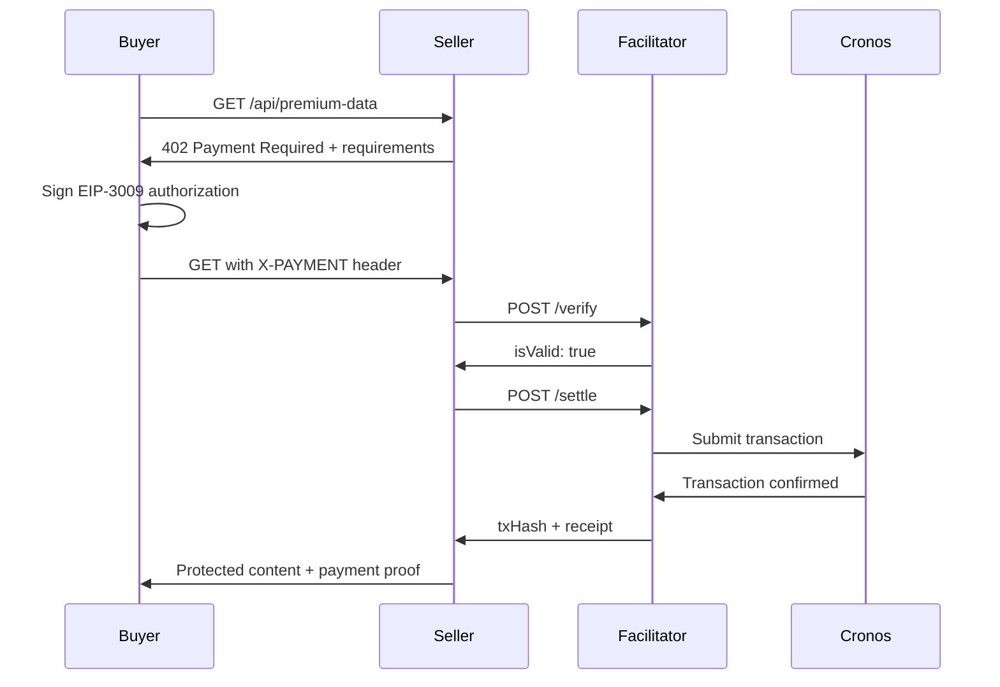

# x402 Facilitator Integration Guide

This guide explains how to integrate Cronos x402 Facilitator for programmatic payment settlements in FlowPay.

## Table of Contents

1. [Overview](#overview)
2. [How x402 Works](#how-x402-works)
3. [Payment Flow](#payment-flow)
4. [Implementation Examples](#implementation-examples)
5. [Best Practices](#best-practices)

## Overview

The **Cronos x402 Facilitator** is a third-party service that enables sellers to verify and settle blockchain payments without running blockchain infrastructure. It acts as the core engine for x402 transactions on Cronos.

### Key Benefits

- ✅ **No Infrastructure**: No nodes, no transaction monitoring, no gas management
- ✅ **Gasless Payments**: Users don't need CRO for gas (via EIP-3009)
- ✅ **HTTP API**: Simple REST API instead of complex blockchain operations
- ✅ **Production-Ready**: Stateless design with comprehensive error handling
- ✅ **Low Cost**: Extremely low Cronos transaction fees enable micropayments

### URLs

- **Facilitator API**: https://facilitator.cronoslabs.org/v2/x402
- **Health Check**: https://facilitator.cronoslabs.org/healthcheck
- **SDK**: [@crypto.com/facilitator-client](https://www.npmjs.com/package/@crypto.com/facilitator-client)
- **Source Code**: https://github.com/crypto-com/facilitator-client-ts

## How x402 Works

x402 extends HTTP 402 Payment Required status code with machine-readable payment requirements.

### Core Components

1. **Buyer** - Wallet/AI agent requesting paid content
2. **Seller** - Your API/resource server
3. **Facilitator** - Cronos x402 service
4. **Blockchain** - Cronos EVM for settlement

### Payment Protocol



## Payment Flow

### Step 1: Request Resource (Buyer)

```typescript
const response = await fetch('https://api.example.com/premium-data');

if (response.status === 402) {
  const data = await response.json();
  // data contains paymentRequirements
}
```

### Step 2: 402 Response (Seller)

```typescript
// Express.js example
app.get('/api/premium-data', (req, res) => {
  const paymentHeader = req.headers['x-payment'];
  
  if (!paymentHeader) {
    return res.status(402).json({
      error: 'Payment Required',
      x402Version: 1,
      paymentRequirements: {
        scheme: 'exact',
        network: 'cronos-testnet', // or 'cronos' for mainnet
        payTo: process.env.SELLER_WALLET,
        asset: '0xc01efAaF7C5C61bEbFAeb358E1161b537b8bC0e0', // USDC.e on testnet
        description: 'Premium API access',
        mimeType: 'application/json',
        maxAmountRequired: '1000000', // 1 USDC (6 decimals)
        maxTimeoutSeconds: 300,
      },
    });
  }
  
  // Process payment (see Step 4)
});
```

### Step 3: Sign Authorization (Buyer)

```typescript
import { ethers } from 'ethers';

function generateNonce() {
  return ethers.hexlify(ethers.randomBytes(32));
}

async function createPaymentHeader({ wallet, paymentRequirements, network }) {
  const { payTo, asset, maxAmountRequired, maxTimeoutSeconds } = paymentRequirements;
  
  const nonce = generateNonce();
  const validAfter = 0;
  const validBefore = Math.floor(Date.now() / 1000) + maxTimeoutSeconds;
  
  // EIP-712 domain
  const domain = {
    name: 'Bridged USDC (Stargate)',
    version: '1',
    chainId: network === 'cronos-testnet' ? '338' : '25',
    verifyingContract: asset,
  };
  
  // EIP-712 types
  const types = {
    TransferWithAuthorization: [
      { name: 'from', type: 'address' },
      { name: 'to', type: 'address' },
      { name: 'value', type: 'uint256' },
      { name: 'validAfter', type: 'uint256' },
      { name: 'validBefore', type: 'uint256' },
      { name: 'nonce', type: 'bytes32' },
    ],
  };
  
  // Message to sign
  const message = {
    from: wallet.address,
    to: payTo,
    value: maxAmountRequired,
    validAfter,
    validBefore,
    nonce,
  };
  
  // Sign with EIP-712
  const signature = await wallet.signTypedData(domain, types, message);
  
  // Create payment header
  const paymentHeader = {
    x402Version: 1,
    scheme: 'exact',
    network,
    payload: {
      from: wallet.address,
      to: payTo,
      value: maxAmountRequired,
      validAfter,
      validBefore,
      nonce,
      signature,
      asset,
    },
  };
  
  // Base64 encode
  return Buffer.from(JSON.stringify(paymentHeader)).toString('base64');
}
```

### Step 4: Verify Payment (Seller)

```typescript
import axios from 'axios';

const FACILITATOR_URL = 'https://facilitator.cronoslabs.org/v2/x402';

async function verifyPayment(paymentHeader, paymentRequirements) {
  const response = await axios.post(`${FACILITATOR_URL}/verify`, {
    x402Version: 1,
    paymentHeader,
    paymentRequirements,
  }, {
    headers: {
      'Content-Type': 'application/json',
      'X402-Version': '1',
    },
  });
  
  return response.data; // { isValid: true/false, invalidReason?: string }
}
```

### Step 5: Settle Payment (Seller)

```typescript
async function settlePayment(paymentHeader, paymentRequirements) {
  const response = await axios.post(`${FACILITATOR_URL}/settle`, {
    x402Version: 1,
    paymentHeader,
    paymentRequirements,
  }, {
    headers: {
      'Content-Type': 'application/json',
      'X402-Version': '1',
    },
  });
  
  return response.data;
  /*
  {
    event: 'payment.settled',
    txHash: '0x...',
    from: '0x...',
    to: '0x...',
    value: '1000000',
    blockNumber: 12345,
    timestamp: 1234567890
  }
  */
}
```

## Implementation Examples

### Complete Seller Endpoint

```typescript
import express from 'express';
import axios from 'axios';

const app = express();
app.use(express.json());

const FACILITATOR_URL = 'https://facilitator.cronoslabs.org/v2/x402';
const SELLER_WALLET = process.env.SELLER_WALLET;
const USDC_CONTRACT = '0xc01efAaF7C5C61bEbFAeb358E1161b537b8bC0e0'; // Testnet

app.get('/api/premium-data', async (req, res) => {
  const paymentHeader = req.headers['x-payment'];
  
  // Step 1: Check payment header
  if (!paymentHeader) {
    return res.status(402).json({
      error: 'Payment Required',
      x402Version: 1,
      paymentRequirements: {
        scheme: 'exact',
        network: 'cronos-testnet',
        payTo: SELLER_WALLET,
        asset: USDC_CONTRACT,
        description: 'Premium API data access',
        mimeType: 'application/json',
        maxAmountRequired: '1000000', // 1 USDC
        maxTimeoutSeconds: 300,
      },
    });
  }
  
  try {
    const paymentRequirements = {
      scheme: 'exact',
      network: 'cronos-testnet',
      payTo: SELLER_WALLET,
      asset: USDC_CONTRACT,
      description: 'Premium API data access',
      mimeType: 'application/json',
      maxAmountRequired: '1000000',
      maxTimeoutSeconds: 300,
    };
    
    // Step 2: Verify payment
    const verifyRes = await axios.post(`${FACILITATOR_URL}/verify`, {
      x402Version: 1,
      paymentHeader,
      paymentRequirements,
    }, {
      headers: { 'Content-Type': 'application/json', 'X402-Version': '1' },
    });
    
    if (!verifyRes.data.isValid) {
      return res.status(402).json({
        error: 'Invalid payment',
        reason: verifyRes.data.invalidReason,
      });
    }
    
    // Step 3: Settle payment
    const settleRes = await axios.post(`${FACILITATOR_URL}/settle`, {
      x402Version: 1,
      paymentHeader,
      paymentRequirements,
    }, {
      headers: { 'Content-Type': 'application/json', 'X402-Version': '1' },
    });
    
    // Step 4: Return content with payment proof
    if (settleRes.data.event === 'payment.settled') {
      return res.status(200).json({
        data: { premiumContent: 'Your premium data here' },
        payment: {
          txHash: settleRes.data.txHash,
          from: settleRes.data.from,
          to: settleRes.data.to,
          value: settleRes.data.value,
          blockNumber: settleRes.data.blockNumber,
          timestamp: settleRes.data.timestamp,
        },
      });
    } else {
      return res.status(402).json({
        error: 'Payment settlement failed',
        reason: settleRes.data.error,
      });
    }
  } catch (error) {
    console.error('Payment processing error:', error);
    return res.status(500).json({
      error: 'Server error processing payment',
      details: error.response?.data || error.message,
    });
  }
});

app.listen(3000, () => {
  console.log('Server running on port 3000');
});
```

### Complete Buyer Flow

```typescript
import { ethers } from 'ethers';
import axios from 'axios';

async function payForResource(resourceUrl: string, wallet: ethers.Wallet) {
  try {
    // Step 1: Initial request
    const initialResponse = await axios.get(resourceUrl).catch(err => err.response);
    
    // Step 2: Check for 402
    if (initialResponse.status !== 402) {
      return initialResponse.data;
    }
    
    const { paymentRequirements } = initialResponse.data;
    
    // Step 3: Create payment header
    const paymentHeader = await createPaymentHeader({
      wallet,
      paymentRequirements,
      network: paymentRequirements.network,
    });
    
    // Step 4: Retry with payment
    const paidResponse = await axios.get(resourceUrl, {
      headers: { 'X-PAYMENT': paymentHeader },
    });
    
    return paidResponse.data;
  } catch (error) {
    console.error('Payment error:', error);
    throw error;
  }
}

// Usage
const provider = new ethers.JsonRpcProvider('https://evm-t3.cronos.org');
const wallet = new ethers.Wallet(process.env.PRIVATE_KEY, provider);

const result = await payForResource(
  'https://api.example.com/premium-data',
  wallet
);
```

## Best Practices

### 1. Environment Variables

```bash
# .env
VITE_X402_FACILITATOR_URL=https://facilitator.cronoslabs.org/v2/x402
VITE_SELLER_WALLET=0xYourSellerWallet
VITE_USDC_CONTRACT_TESTNET=0xc01efAaF7C5C61bEbFAeb358E1161b537b8bC0e0
VITE_USDC_CONTRACT_MAINNET=0xYourMainnetUSDCAddress
```

### 2. Error Handling

```typescript
try {
  const result = await settlePayment(paymentHeader, requirements);
  
  if (result.event !== 'payment.settled') {
    throw new Error(`Settlement failed: ${result.error}`);
  }
  
  // Success
} catch (error) {
  if (error.response?.status === 402) {
    // Payment required or invalid
  } else if (error.response?.status === 500) {
    // Facilitator error
  } else {
    // Network error
  }
}
```

### 3. Idempotent Requests

The x402 facilitator supports idempotency. Use the same nonce for retries:

```typescript
const nonce = generateNonce();
// Store nonce to retry with same value if needed
```

### 4. Testing

Use Cronos Testnet for development:

```typescript
const network = process.env.NODE_ENV === 'production' 
  ? 'cronos' 
  : 'cronos-testnet';
```

### 5. Monitoring

Log all payment events:

```typescript
console.log('Payment settled:', {
  txHash: result.txHash,
  amount: result.value,
  from: result.from,
  timestamp: result.timestamp,
});
```

## Resources

- **Facilitator API Docs**: https://docs.cronos.org/cronos-x402-facilitator/api-reference
- **Quick Start for Sellers**: https://docs.cronos.org/cronos-x402-facilitator/quick-start-for-sellers
- **Quick Start for Buyers**: https://docs.cronos.org/cronos-x402-facilitator/quick-start-for-buyers
- **x402 Examples**: https://github.com/cronos-labs/x402-examples
- **SDK NPM**: https://www.npmjs.com/package/@crypto.com/facilitator-client

---

For integration support, refer to the [Cronos Documentation](https://docs.cronos.org) or join the [Cronos Discord](https://discord.gg/cronos).
